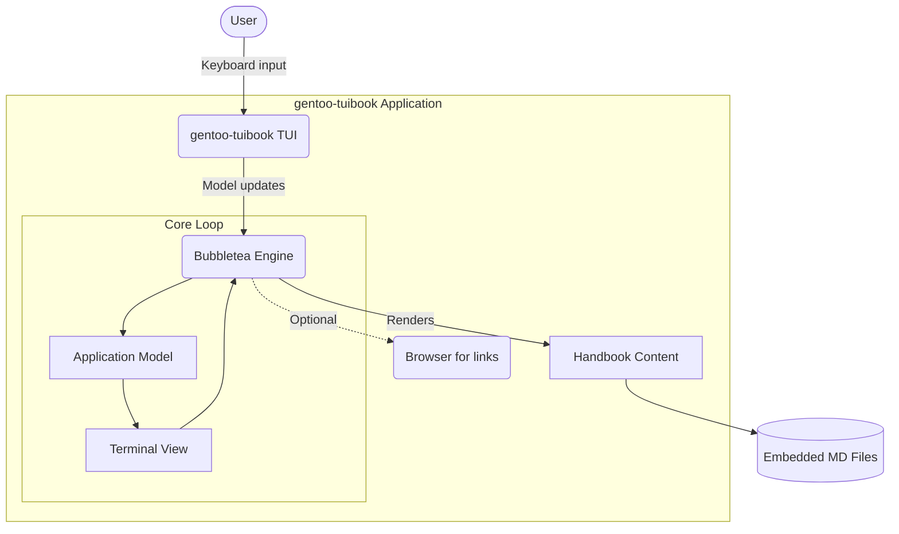

<table border="0">
  <tr>
    <td width="200" align="center" valign="top">
      
    </td>
    <td valign="top">
      <h1>gentoo-tuibook</h1>
      <p><strong>Terminal UI for the Gentoo Linux installation handbook</strong><br/>
      <em>Keyboard-driven reader that embeds the Gentoo handbook as Markdown, rendered via Bubbletea and Glamour.</em></p>
      <p>
        <a href="LICENSE"></a>
        
      </p>
    </td>
  </tr>
</table>

---

<p align="center">
  
</p>

---

<!--toc:start-->
- [gentoo-tuibook](#gentoo-tuibook)
  - [Overview](#overview)
  - [Using as a CLI Tool](#using-as-a-cli-tool)
  - [Installation](#installation)
  - [Key Features ](#key-features)
  - [Technical Architecture](#technical-architecture)
  - [Command Reference](#command-reference)
  - [Roadmap & Milestones](#roadmap--milestones)
  - [Acknowledgments](#acknowledgments)
  - [Contributing](#contributing)
  - [License](#license)
<!--toc:end-->

## Overview

**gentoo-tuibook** is a terminal-native reader for the Gentoo Linux installation handbook. No browser, no GUI — just the handbook rendered where Gentoo lives: in the terminal.

For command-line users, this project provides a powerful TUI interface.

At its heart lies **`github.com/gentoo-tuibook`**, a single-binary reader that embeds the full handbook content via `//go:embed`. Built upon **Bubbletea** and **Glamour**, it exposes a keyboard-driven split-pane reader with chapter selection and content rendering.

For end-users, gentoo-tuibook ships with **`gentoo-tuibook`**, a standalone binary with no external runtime dependencies.

---

<p align="center">
  
</p>

---

## Using as a CLI Tool

The CLI provides a straightforward interface to interact with gentoo-tuibook.

The CLI can be installed globally or used locally in your project.

```bash
go install github.com/gentoo-tuibook@latest
```

**Why use `gentoo-tuibook`?**
* **No browser required:** The handbook renders directly in your terminal, alongside your build session.
* **Offline-first:** All content is embedded in a single binary — no network calls after download.
* **Keyboard-driven:** Full navigation with familiar keybindings. No mouse needed.
* **Single binary:** Zero runtime dependencies. One file, everything included.

---

## Installation

### Via Go Install (Recommended)

```bash
go install github.com/gentoo-tuibook@latest
```

### From Source (Natively)

You can build and install the binary natively on Linux or UNIX-like systems using the standard `Makefile`:

```bash
git clone https://github.com/julesklord/gentoo-tuibook.git
cd gentoo-tuibook
make build
# Binary at: ./gentoo-tuibook
```

To install the binary globally to `/usr/local/bin`:

```bash
sudo make install
```

### Via Gentoo Portage (ebuild)

If you are running Gentoo Linux, you can install it using the ebuild provided in the repository. Add the ebuild to your local overlay:

```bash
# Create category directory in your local overlay
sudo mkdir -p /usr/local/portage/app-text/gentoo-tuibook

# Copy the ebuild into it
sudo cp ebuild/app-text/gentoo-tuibook/gentoo-tuibook-9999.ebuild /usr/local/portage/app-text/gentoo-tuibook/

# Generate digest / manifest
sudo ebuild /usr/local/portage/app-text/gentoo-tuibook/gentoo-tuibook-9999.ebuild manifest

# Emerge the package
sudo emerge --ask app-text/gentoo-tuibook
```

## Key Features

*   **Handbook Browser**: Chapter list with split-pane content viewer — navigate chapters on the left, read on the right.
*   **Markdown Rendering**: Full Markdown rendering via Glamour with automatic terminal theme detection.
*   **Link Extraction**: Extracts and cycles through URLs in handbook content for quick browser access.
*   **Mode Switching**: Toggle between navigation mode (LISTA) and reading mode (READ) with link focus.
*   **Embedded Content**: Eleven handbook chapters embedded directly into the binary via `//go:embed`.
*   **Scriptable Content Fetch**: Standalone Go scripts in `scripts/` to pull fresh content from the Gentoo wiki API.
*   **Highly Configurable**: Supports robust, runtime-customizable theme colors and sidebar sizes via `$XDG_CONFIG_HOME/gentoo-tuibook/config.json`.

---

## Technical Architecture

A single-binary Go application — no server, no database, no runtime dependencies beyond the OS terminal.



### Core Components

- **`github.com/gentoo-tuibook`**: Main `package main` with Bubbletea model/view/update loop, chapter list, viewport, link extraction, and Glamour-based Markdown rendering.
- **`scripts/fetch.go`, `scripts/fetch_full.go` and `scripts/fetch_all.go`**: Standalone Go scripts that pull HTML from the Gentoo wiki API and convert to Markdown.

---

### Key Engineering Decisions

- **Flat `main` package over multi-package layout:** No server, no API, no multi-package logic justifies a single `package main`. Keeps compilation trivial and dependency graph minimal.
- **Embedded content over HTTP fetch at runtime:** The handbook changes slowly. Embedding makes the binary self-contained and offline-ready.
- **Runtime Configuration over Build-time hacks:** Themes, layout size and defaults are dynamically configurable in runtime via the JSON config file. This guarantees clean compile cycles and zero friction for packages maintainers.

---

## Command Reference

For a comprehensive breakdown, see the **[Official Docs](docs/wiki/index.md)**.

*   **[Installation Guide](docs/wiki/development.md)**
*   **[CLI Command Reference](docs/wiki/index.md)**
*   **[Technical Architecture](docs/wiki/architecture.md)**

### Keyboard Shortcuts

Our navigation system utilizes visual directional mappings and Vim-inspired shortcuts:

| Key | Mode | Action |
| :--- | :--- | :--- |
| `↑/↓` or `k/j` | All Modes | Move selection (LIST), scroll manual text (READ), cycle through links (LINKS) |
| `Enter` or `l`/`Right` | List Mode | Open selected chapter |
| `l`, `Right`, or `Tab` | Read Mode | Enter Markdown link navigation mode |
| `Enter` | Link Mode | Open/follow selected hyperlink |
| `o` | Link Mode | Open selected external URL in browser |
| `h`, `Left`, or `Esc` | Read / Link | Go back to list mode / go back to read mode |
| `q` or `Ctrl+C` | All Modes | Quit application safely |

---

## Runtime Configuration Guide

`gentoo-tuibook` is highly customizable via a standard JSON configuration file. Returning users and advanced Linux enthusiasts can tweak the colors, layout, default settings, and reading preferences to build their perfect terminal setup.

### File Location

The configuration file is loaded dynamically from:
- **UNIX / Linux**: `$XDG_CONFIG_HOME/gentoo-tuibook/config.json` (defaults to `~/.config/gentoo-tuibook/config.json`)

If the file does not exist, the TUI automatically generates a default config file with sensible, premium settings on its first launch.

### Parameters Semantic Breakdown

| Field | Type | Default | Description |
| :--- | :--- | :--- | :--- |
| `default_arch` | `string` | `"auto"` | The default hardware architecture manual to display on start (e.g., `"amd64"`, `"arm64"`, `"x86"`, `"ppc"`, `"auto"`). `"auto"` falls back to `"amd64"`. |
| `default_lang` | `string` | `"auto"` | Default ISO 639-1 language code for handbook translation files (e.g., `"en"`, `"es"`, `"de"`, `"fr"`, `"auto"`). `"auto"` automatically queries environment locale variables. |
| `show_welcome` | `boolean` | `true` | When set to `true`, displays the stylized Welcome Screen on launch. Set to `false` to skip it and boot straight into the chapter list view. |
| `wrap_width` | `integer` | `0` | Capping width for word wrap formatting (in columns). Set to `0` to wrap dynamically to the split viewport width, or specify a fixed width (like `80` or `100`) for premium reading on ultra-wide terminal emulators. |
| `custom_style_path` | `string` | `""` | Absolute filepath pointing to a custom Glamour JSON stylesheet. Allows loading customized Markdown themes. If left empty `""` or invalid, falls back to the dynamic Gentoo Pink stylesheet. |
| `sidebar.width_percent` | `integer` | `25` | Percentage of terminal width assigned to the chapter list sidebar (e.g. `25` for a quarter of the width). |
| `sidebar.min` | `integer` | `20` | Minimum column width allowed for the sidebar to prevent visual squeezing of chapter names. |
| `sidebar.max` | `integer` | `40` | Maximum column width allowed for the sidebar to preserve screen real estate. |
| `theme.brand_primary` | `string` | `"#ff007f"` | The primary highlight and accent color of the TUI (Vim badges, borders, markdown headers, URLs, selected items, etc.). Supports hex codes. |
| `theme.surface_bg` | `string` | `"#060608"` | The main background color of the application. |
| `theme.surface_3` | `string` | `"#1c2130"` | The secondary color for borders, boxes, and unselected text headers. |
| `theme.text` | `string` | `"#EBEBEB"` | The default text foreground color. |

### Complete JSON Template Example

You can copy and paste the following snippet directly into your local configuration file to start editing:

```json
{
  "default_arch": "auto",
  "default_lang": "auto",
  "show_welcome": true,
  "wrap_width": 80,
  "custom_style_path": "",
  "sidebar": {
    "width_percent": 25,
    "min": 20,
    "max": 40
  },
  "theme": {
    "brand_primary": "#ff007f",
    "surface_bg": "#060608",
    "surface_3": "#1c2130",
    "text": "#EBEBEB"
  }
}
```

---

## Advanced Gentoo Linux Specifications

`gentoo-tuibook` is engineered specifically with **Gentoo Linux**'s strict minimalist, compiler-first philosophy in mind. Here are the advanced details of the TUI architecture and packaging internals:

### 1. Universal Terminal Portability (TTY & SSH)
- **Dynamic Color Profile Detection**: Rather than forcing TrueColor (24-bit ANSI), the program calls `termenv.ColorProfile()` during runtime initialization to query the active stdout descriptor.
  - On **Modern Emulators**, it renders full high-fidelity HSL tailored colors.
  - On **Virtual Linux Consoles (native kernel TTYs)** or **SSH sessions**, it intelligently degrades and maps hex codes gracefully to standard ANSI 16/256 color sequences. This guarantees no visual clutter or broken escape codes during the Gentoo installation stage.
- **UTF-8 Immunity (ASCII Safe Fallbacks)**: Headings, rules (`hr`), and table boundaries avoid exotic, high-plane Unicode characters.
  - Structural blocks utilize fallback-safe tokens (`#`, `##`, `###`, `-`, `|`, `+`).
  - This ensures perfect rendering on systems that have not yet loaded local fonts or Unicode support in early boot stages.

### 2. TUI-Safe Logging Architecture
- Logging directly to Stdout/Stderr corrupts the Bubble Tea alternate screen buffer. To prevent visual garbage, `gentoo-tuibook` utilizes a robust log redirection layout:
  - All standard logger commands (`log.Printf`, system failures, etc.) are redirected dynamically to a physical file: `$XDG_CONFIG_HOME/gentoo-tuibook/debug.log`.
  - Config directory and log creation follow XDG base directory specifications.

### 3. Portage Integration & Custom Ebuilds
The repository includes a Portage-compliant ebuild: [gentoo-tuibook-9999.ebuild](file:///K:/source/repos/gentoo-tuibook/ebuild/app-text/gentoo-tuibook/gentoo-tuibook-9999.ebuild).

#### How the Live Ebuild (`9999`) works:
- Uses `git-r3` and `go-module` eclasses.
- In the `src_unpack` phase, Portage calls `go-module_live_vendor` to download all Go dependency modules safely through the proxy under internet access before locking the network sandbox.
- In `src_compile`, Portage calls our clean native `Makefile`:
  ```bash
  emake GOFLAGS="-mod=vendor" build
  ```
- In `src_install`, Portage runs `emake DESTDIR="${D}" PREFIX="/usr" install` to place the binary under the correct target image filesystem.

#### Freezing a Stable Version:
To lock down a stable release (e.g. `v1.0.0`) in your local overlay, simply copy the ebuild:
```bash
cp gentoo-tuibook-9999.ebuild gentoo-tuibook-1.0.0.ebuild
```
Portage will automatically intercept the version number, ignore the live branch, and fetch/compile the corresponding tag/release tarball from Git.

### 4. Updating Content Lifecycle
If the official Gentoo handbook updates on the wiki, you can easily refresh the embedded database without modifying Go code:
1. **Execute Fetch Scripts**:
   ```bash
   cd scripts
   go run fetch_all.go
   ```
   This script calls the official Gentoo Wiki API, downloads the newest contents, converts HTML to clean Markdown, and overwrites `data/handbook/` MD files.
2. **Recompile**:
   ```bash
   make build
   ```
   Go's `//go:embed` directive will automatically bake the updated contents directly inside the binary during compilation.

---

## Roadmap & Milestones

| Version | Status | Milestone |
| --- | --- | --- |
| **v0.1.0** | ✅ | Initial TUI with handbook browser and Markdown rendering |
| **v0.2.0** | ⏳ | Search, bookmarks, configurable theme |
| **v0.3.0** | ⏳ | Multi-architecture support (ARM64, multi-page display) |

---

## Acknowledgments

- **[Charmbracelet](https://github.com/charmbracelet)** — Bubbletea, Glamour, Lipgloss, and the entire Charm ecosystem.
- **[Gentoo Wiki](https://wiki.gentoo.org)** — Source of the handbook content.

## Contributing

Pull requests are welcome. For major changes, open an RFC issue first. See `CONTRIBUTING.md` for guidelines.

## License

<p align="center">
  Engineered by the gentoo-tuibook contributors.<br>
  Released under the terms of the MIT License.
</p>
